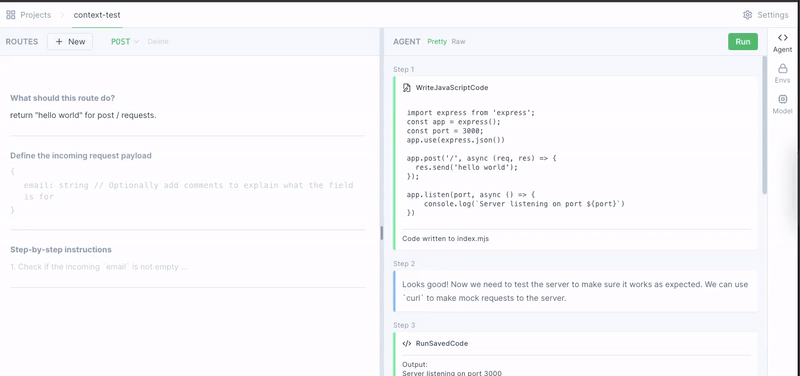

# Contributing
If you want to contribute, open a PR, issue, or start a discussion on our [Discord](https://discord.gg/dSBY3ms2Qr).

# 🤖 Adding a new model provider
If you want to add a new model provider (like OpenAI or HuggingFace) complete the following steps and create a PR.

When you add a provider you can also add a specific model (like OpenAI's GPT-4) under that provider.

Here is an [example code for adding a new provider](./NEW_PROVIDER_EXAMPLE.md).

## 1. Add the provider to **frontend**
- Add provider name to `ModelProvider` enum in [state/model.ts](state/model.ts)
- Add provider and models template to `modelTemplates` object in [state/model.ts](state/model.ts)
  - `creds` and `args` defined in the `modelTemplates` are accessible on backend in `get_model` under their exact names in `config["args"]` object.
- Add provider's PNG icon image to `public/`
- Add provider's icon path to `iconPaths` object in [components/icons/ProviderIcon.tsx](components/icons/ProviderIcon.tsx)

## 2. Add provider to **backend** ([api-service/models/base.py](api-service/models/base.py))
- Add provider name to `ModelProvider` enum
- Add provider integration (implementing LangChain's `BaseLanguageModel`) to `get_model` function. You can use an existing integration from LangChain or create a new integration from scratch.

The new provider integrations should be placed in `api-service/models/providers/`.

## Provider integrations
We use [LangChain](https://github.com/hwchase17/langchain) under the hood, so if you are adding a new integration you have to implement the `BaseLanguageModel` class. That means implementing the `_acall` async method that calls the model with a prompt and returns the output. We then use this method for calling the model.

### **Using [LangChain](https://python.langchain.com/en/latest/modules/models/llms/integrations.html) integration**
You can often use existing LangChain integrations to add new model providers to e2b with just a few modifications.

[Here](api-service/models/providers/replicate.py) is an example of modified [Replicate](https://replicate.com/) integration. We had to add `_acall` method to support async execution and override `validate_environment` to prevent checking if the Replicate API key env var is set up because we pass the env var via a normal parameter.

If you are modifying existing LangChain integration add it to `api-service/models/providers/<provider>.py`.

### **From scratch**
You can follow the [langchain's guide](https://python.langchain.com/en/latest/modules/models/llms/examples/custom_llm.html) to implement the `LLM` class (it inherits from `BaseLanguageModel`).

Here is an example of the implementation:

```py
from typing import List, Optional
from langchain.llms.base import LLM

class NewModelProviderWithStreaming(LLM):
    temperature: str
    new_provider_api_token: str

    # You only need to implement the `_acall` method
    async def _acall(self, prompt: str, stop: Optional[List[str]] = None) -> str:
        # Call the model and get outputs
        # You can use `temperature` and `new_provider_api_token` args
        text = ""
        for token in outputs:
            text += token
            if self.callback_manager.is_async:
                await self.callback_manager.on_llm_new_token(
                    token,
                    verbose=self.verbose,
                    # We explicitly flush the logs in log queue because the calls to this model are not actually async so they block.
                    flush=True,
                )
            else:
                self.callback_manager.on_llm_new_token(
                    token,
                    verbose=self.verbose,
                )
        return text
```

## 3. Test
Test if the provider works by starting the app, selecting the provider and model in the "Model" sidebar menu and trying to "Run" it. 



Then add a screenshot of agent's steps to the PR.
